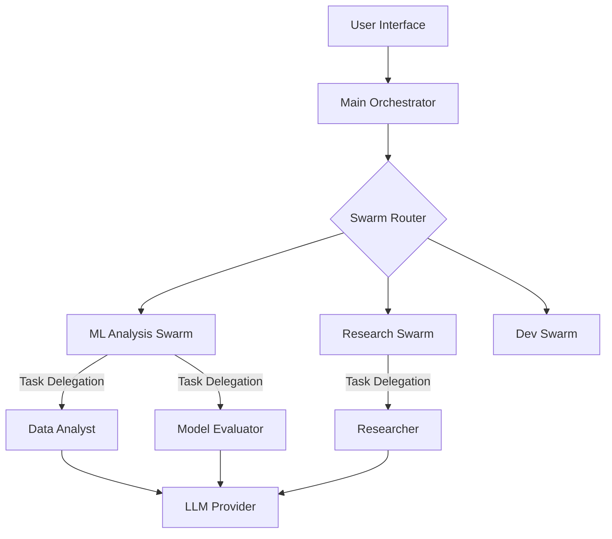

# CrewAI Multi-Agent Swarm System

A comprehensive multi-agent framework using CrewAI, featuring multiple specialized agent swarms for different domains including machine learning, research, development, business intelligence, and documentation.

## 🤖 Overview

This project implements a versatile multi-agent system where different specialized agent swarms collaborate on complex workflows. Each swarm contains domain-specific agents designed for particular tasks and industries.

## 🖥️ Chat Interfaces

### Streamlit Web App (Recommended)

Interact with the swarms using a modern chat interface.

```bash
streamlit run interface_web.py
```

### Terminal CLI

Interact via the command line.

```bash
python interface_cli.py
```

## 🚀 Available Agent Swarms

### 1. 🤖 ML Analysis Swarm

**Specialization**: Random Forest and machine learning evaluation
**Agents**: 5 specialized ML agents

- **Data Analyst**: Dataset exploration and preprocessing recommendations
- **Model Evaluator**: Performance assessment and comparison analysis
- **Feature Engineer**: Feature importance analysis and engineering suggestions
- **Hyperparameter Optimizer**: Parameter tuning and optimization strategies
- **Report Writer**: Comprehensive report generation for stakeholders

### 2. 🔬 Research Swarm

**Specialization**: ML research, trends, and innovation
**Agents**: 4 research-focused agents

- **Literature Reviewer**: Academic paper analysis and scholarly research
- **Trend Analyzer**: Industry trends and market developments
- **Innovation Scout**: Novel applications and breakthrough technologies
- **Research Summarizer**: Synthesis of research findings

### 3. 🎓 Academic Research Swarm

**Specialization**: Scholarly research and academic analysis
**Agents**: 5 academic research agents

- **Literature Reviewer**: Comprehensive academic literature review
- **Research Designer**: Experimental design and methodology
- **Academic Data Analyst**: Statistical analysis for research
- **Methodology Expert**: Research methodology and best practices
- **Publication Writer**: Academic writing and paper preparation

### 4. 📝 Content Research Swarm

**Specialization**: Content creation and research
**Agents**: Content-focused agents

- **Content Researcher**: Research for content creation
- **Content Strategist**: Content planning and strategy
- **Content Writer**: Content generation and writing

### 5. 💼 Business Intelligence Swarm

**Specialization**: Business analysis and intelligence
**Agents**: Business-focused agents

- **Market Analyst**: Market research and analysis
- **Business Strategist**: Strategic business planning
- **Data Analyst**: Business data analysis

### 6. 💻 Development & Code Swarm

**Specialization**: Software development and coding
**Agents**: Development-focused agents

- **Code Reviewer**: Code review and quality assessment
- **Developer**: Code generation and implementation
- **Architect**: System design and architecture

### 7. 📚 Documentation Swarm

**Specialization**: Technical documentation
**Agents**: Documentation-focused agents

- **Technical Writer**: Technical documentation creation
- **Documentation Planner**: Documentation structure and planning
- **Content Editor**: Documentation editing and refinement

## 🛠️ Installation

### Prerequisites

- Python 3.8+
- LLM Provider (Ollama, OpenAI, Anthropic, Google, or Azure)

### Quick Setup

1. **Install dependencies:**

   ```bash
   cd projects/Crewai
   pip install -r requirements.txt
   ```

2. **Set up LLM provider** (choose one):

   **Option 1: Ollama (Free, Recommended)**

   ```bash
   # Install Ollama from https://ollama.ai
   ollama pull llama3.1:8b
   export OLLAMA_BASE_URL=http://localhost:11434
   ```

   **Option 2: OpenAI**

   ```bash
   export OPENAI_API_KEY=your_api_key_here
   pip install langchain-openai
   ```

   **Option 3: Anthropic**

   ```bash
   export ANTHROPIC_API_KEY=your_api_key_here
   pip install langchain-anthropic
   ```

   **Option 4: Google**

   ```bash
   export GOOGLE_API_KEY=your_google_key
   pip install langchain-google-genai
   ```

3. **Optional: Web Search**

   ```bash
   export SERPER_API_KEY=your_serper_key  # Get free key at https://serper.dev
   ```

## 🚀 Usage

### Command Line Interface

**Run ML Analysis:**

```bash
python main.py --run ml
```

**Run Research Swarm:**

```bash
python main.py --run research
```

**Run Academic Research:**

```bash
python main.py --run research_academic
```

**Run Business Intelligence:**

```bash
python main.py --run business_intelligence
```

**Run Development & Code:**

```bash
python main.py --run dev_code
```

**Run Documentation:**

```bash
python main.py --run documentation
```

**Check Status:**

```bash
python main.py --status
```

**List Available Crews:**

```bash
python main.py --list-crews
```

**Setup Environment:**

```bash
python main.py --setup
```

### Streamlit Web Interface

Start the web interface:

```bash
streamlit run interface_web.py
```

Then open `http://localhost:8501` in your browser.

### CLI Interface

Start the CLI interface:

```bash
python interface_cli.py
```

## ⚙️ Configuration

### Environment Variables

Create a `.env` file or set environment variables:

```env
# LLM Provider (choose one)
LLM_PROVIDER=ollama  # or openai, anthropic, google, azure

# Ollama Configuration
OLLAMA_BASE_URL=http://localhost:11434
OLLAMA_MODEL=llama3.1:8b

# OpenAI Configuration
OPENAI_API_KEY=your_openai_key
OPENAI_MODEL_NAME=gpt-4o-mini

# Anthropic Configuration
ANTHROPIC_API_KEY=your_anthropic_key
ANTHROPIC_MODEL=claude-3-5-sonnet-20241022

# Google Configuration
GOOGLE_API_KEY=your_google_key
GOOGLE_MODEL=gemini-pro

# Azure OpenAI Configuration
AZURE_OPENAI_API_KEY=your_azure_key
AZURE_OPENAI_ENDPOINT=https://your-resource.openai.azure.com
AZURE_OPENAI_DEPLOYMENT_NAME=your_deployment_name

# Optional: Web Search
SERPER_API_KEY=your_serper_key

# System Configuration
VERBOSE=true
PROCESS_TYPE=sequential  # or hierarchical
```

## 🏭 Production Deployment

### Deployment Strategy

For production, we recommend deploying the API service (if exposed) or the Streamlit app using Docker.

### Docker Deployment

1. **Build the image**:

   ```bash
   docker build -t crewai-swarm:latest .
   ```

2. **Run the container**:

   ```bash
   docker run -d \
     -p 8501:8501 \
     --env-file .env.production \
     --name crewai-swarm \
     crewai-swarm:latest
   ```

### Architecture Overview



### Scaling Strategies

1. **Horizontal Scaling**: Deploy multiple instances of the container behind a load balancer. Note that agent operations are stateful within a single execution but stateless between separate requests.
2. **Worker Queues**: For high-volume environments, decouple the request from execution using a message queue (e.g., Redis/Celery). The web UI submits a job ID, and worker containers process the swarm execution.

### Monitoring & Observability

- **Logs**: All agent activities and LLM interactions are logged to stdout/stderr in JSON format for ingestion by ELK/Loki.
- **Metrics**: Monitor container CPU/Memory usage. Heavy agent workflows can be memory-intensive.
- **Cost Tracking**: Track token usage per request to manage LLM API costs.

## 📊 Output

Results are saved to the `outputs/` directory with:
- Markdown reports
- Analysis summaries
- Generated documentation

## 🔧 Advanced Configuration

### Process Types

- **Sequential**: Agents work one after another
- **Hierarchical**: Agents work in a hierarchical structure

### Custom Agents

You can create custom agents by extending the base agent classes in `agents/`.

### Custom Tools

Add custom tools in the `tools/` directory.

## 🧪 Testing

Run tests:

```bash
python run_tests.py
```

## 📚 Documentation

- [LLM Setup Guide](LLM_SETUP.md)
- [Tools Summary](TOOLS_SUMMARY.md)
- [Test Instructions](TEST_INSTRUCTIONS.md)

## 🤝 Contributing

Contributions are welcome! Please feel free to submit a Pull Request.

## 📄 License

This project is part of the JJB Gallery portfolio. See the main repository LICENSE file.

## 🔗 Related Projects

- [ChatUI](../ChatUi/README.md) - Chat interface
- [RAG Model](../RAG_Model/README.md) - Document Q&A
- [LiteLLM](../litellm/README.md) - LLM proxy server
- [Terminal Agents](../terminal_agents/README.md) - Terminal AI agent
